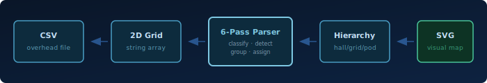
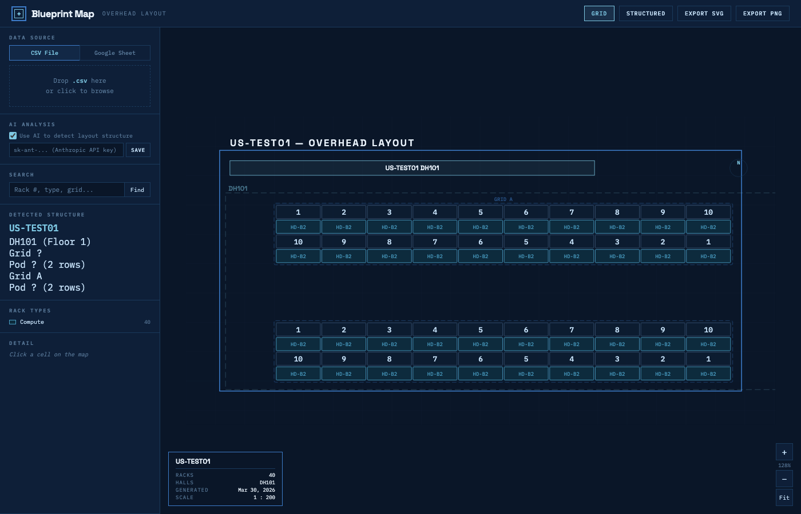
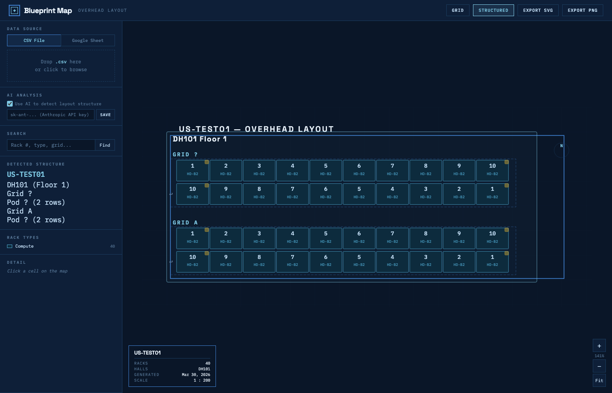

<div align="center">
  

  <br>

  **For DCTs who read CSV overheads and see racks, not cells.**

  Zero-dependency browser app that turns datacenter overhead spreadsheets into zoomable visual floor maps. Drop a CSV, get a blueprint.

  [](LICENSE)
  [](https://github.com/rpatino-cw/blueprint-map/issues)
  [](https://github.com/rpatino-cw/blueprint-map/actions)
  [](https://rpatino-cw.github.io/blueprint-map/)
</div>

---

## Try it

1. Open [**Blueprint Map**](https://rpatino-cw.github.io/blueprint-map/)
2. Drop your overhead `.csv` onto the drop zone

That's it. Map renders in seconds. No install, no build step, no dependencies.

```bash
# Or run locally
git clone https://github.com/rpatino-cw/blueprint-map.git
cd blueprint-map
open index.html
```

---

## What it does

- **Visualize** overhead layout CSVs as zoomable, color-coded blueprints
- **Auto-detect** rack types, halls, grids, pods, and serpentine numbering with a 6-pass parser
- **Export** publication-ready SVG vectors and 2x PNG bitmaps
- **AI-assisted** (optional) — Claude Haiku identifies structure in messy spreadsheets

---

## How it works



The parser takes a raw 2D grid of strings and figures out what everything means — which cells are rack numbers, which are types, where pods start and end, which halls exist. Six passes, no configuration required:

| Pass | Name | What it does |
|------|------|-------------|
| 1 | **Classify** | Label every cell: rack number, rack type, hall header, grid label, annotation |
| 1.5a | **Merge** | Combine multi-cell grid labels (e.g. "GRID-GROUP 1" spanning 3 columns) |
| 1.5b | **Patterns** | Statistical row analysis — detect stat rows, column headers |
| 2 | **Detect** | Find contiguous rack blocks, identify serpentine numbering pairs |
| 2.5 | **Discover** | Unsupervised type discovery — find rack types not in the library |
| 3 | **Group** | Cluster blocks into sections by column alignment, apply pod=20 heuristic |
| 4 | **Assign** | Build hierarchy: sections → pods → grids → halls using header proximity |

---

## Views

| View | Description |
|------|-------------|
| **Grid** | 1:1 cell layout — every cell from the original CSV, color-coded by classification |
| **Structured** | Clean rack diagram grouped by hall, grid, and pod. Serpentine arrows, corner badges, type fills |

<!-- Replace with real screenshots when available:


-->

---

## Export

- **SVG** — vector output, scales to any size, perfect for printing or embedding in docs
- **PNG** — 2x resolution bitmap, ready to paste in Slack, Jira, or Confluence

---

## AI (optional)

Paste your Anthropic API key in the sidebar. Blueprint Map sends a small sample of your CSV to Claude Haiku to detect halls, rack rows, and custom device types. Results are cached by CSV hash — same file never hits the API twice.

No key? No problem. The rule-based 6-pass parser handles standard overhead formats on its own.

---

## Rack types

25+ built-in rack type categories with automatic prefix matching:

| Category | Prefixes |
|----------|----------|
| Compute | `HD-`, `NVL`, `GB200`, `GB300` |
| TOR / Edge | `T0-`, `T1-`, `T2-`, `T3-`, `T4-` |
| IB Spine | `IB `, `QM` |
| Storage | `SC-`, `stor-` |
| DPR | `DPR-`, `DPU-`, `dpu-` |
| FDP | `FDP` |
| Ring | `RING` |
| Management | `mgmt-` |
| Console / OOB | `con-`, `oob-` |
| Reserved | `RES` |
| Unallocated | `U` (with digit/space guard) |
| ... | + 14 more categories |

Unknown types are auto-discovered via frequency analysis in Pass 2.5.

---

## Testing

47 tests covering all 6 parser passes. Zero dependencies — runs in Node.js using the `vm` module.

```bash
npm test
```

Tests run on Node 18, 20, and 22 via GitHub Actions on every push and PR.

| Suite | Tests | Coverage |
|-------|-------|----------|
| TypeLibrary | 16 | Prefix matching, single-char guard, all categories |
| Helpers | 7 | `decodeDH`, `parseSPLAT` (frontend, RoCE, overflow) |
| Pass 1 | 10 | Hall headers, campus naming, ROWS labels, rack types |
| Pass 2 | 3 | Serpentine detection, multi-type blocks, rack counts |
| Pass 2.5 | 1 | Type category discovery |
| Pass 3 | 2 | Section grouping, block containment |
| Pass 4 | 5 | Hall assignment, SPLAT ranges, grid labels |
| Result | 3 | Field completeness, rack count integrity |

---

## File structure

```
index.html              ← app shell + cache-busted script loader
css/style.css           ← dark datacenter theme
js/
  type-library.js       ← 25+ rack type definitions + prefix matching
  parser.js             ← 6-pass layout analysis engine (~930 lines)
  renderer.js           ← SVG grid + structured view rendering
  ai.js                 ← Claude API integration + response caching
  app.js                ← state management, CSV parsing, UI events
test/
  parser.test.js        ← 47 parser tests (Node.js, zero deps)
  fixtures/             ← anonymized CSV test fixtures
assets/                 ← banner, diagrams, screenshots
.github/workflows/
  test.yml              ← CI: run tests on Node 18/20/22
  bump-version.yml      ← auto-bump cache-bust version on deploy
```

---

## Contributing

Fork it, PR it, no real site data. Keep it simple.

[MIT](LICENSE)
