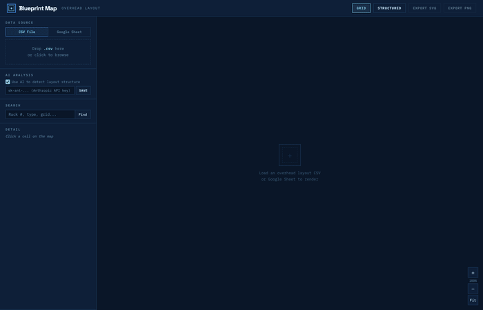

# Blueprint Map

> Turn a spreadsheet of rack names into a visual data center floor map.



## What it does

- **Drop a CSV** (or paste a Google Sheet link) and instantly see your data hall layout as a zoomable blueprint
- **Auto-detects** rack types, grid sections, halls, pods, and serpentine numbering
- **AI-powered** (optional) — uses Claude Haiku to identify structure in messy spreadsheets

## Try it

1. Open [**Blueprint Map**](https://rpatino-cw.github.io/blueprint-map/)
2. Drag your overhead layout `.csv` onto the drop zone

That's it. Your map renders in seconds.

## Run locally

```bash
git clone https://github.com/rpatino-cw/blueprint-map.git
cd blueprint-map
open index.html
```

No install. No build step. No dependencies. Just open the file.

## How it works

The app turns messy datacenter spreadsheets into visual maps. The flow is:

```
CSV file  →  2D grid array  →  4-pass parser  →  hierarchy tree  →  SVG render
```

It takes a dumb 2D array of strings and figures out what everything means — which cells are rack numbers, which are rack types, where pods start and end, which halls exist.

The parser runs 4 passes over the spreadsheet:
1. **Classify** every cell (rack number, rack type, hall header, etc.)
2. **Detect** contiguous rack blocks (rows of sequential numbers)
3. **Group** blocks into sections by column alignment
4. **Assign** sections to halls using header proximity

If AI is enabled, Claude analyzes a sample first and feeds structural hints to the parser.

## Views

| View | What it shows |
|------|---------------|
| **Grid** | 1:1 cell layout — every cell from the CSV, color-coded by type |
| **Structured** | Clean rack diagram grouped by hall, grid, and pod |

## Export

- **SVG** — vector, scales to any size, great for printing
- **PNG** — 2x resolution bitmap, ready to paste in Slack or Jira

## AI (optional)

Paste your Anthropic API key in the sidebar. Blueprint Map sends a small sample of your CSV to Claude Haiku to detect halls, rack rows, and custom device types. Results are cached — same CSV never hits the API twice.

No key? No problem. The rule-based parser works great on its own.

## File structure

```
index.html          ← app shell
css/style.css       ← all styles
js/
  type-library.js   ← rack type definitions + prefix matching
  parser.js         ← 4-pass layout analysis engine
  renderer.js       ← SVG grid + structured view rendering
  ai.js             ← Claude API integration + caching
  app.js            ← state, events, CSV parsing, UI wiring
```
